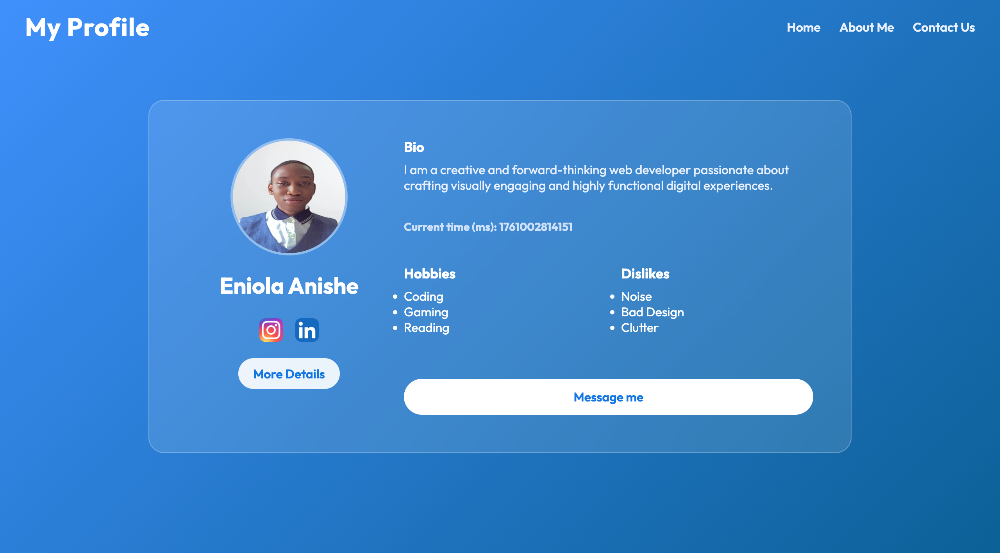

# Profile Card

A responsive, accessible, and elegant profile card application built with HTML, CSS, and JavaScript — now extended into a multi-page experience featuring About Me and Contact pages.

**Live Demo:** [https://enidevhngstageonetask.netlify.app](https://enidevhngstageonetask.netlify.app)

---

## Preview



---

## Features

- Fully responsive layout (mobile & desktop)
- Accessible with keyboard focus and ARIA labels
- Semantic HTML5 structure
- Real-time clock (milliseconds)
- Social links with hover and focus effects
- Uses `data-testid` attributes for test automation
- About Me page with reflective sections (bio, goals, growth areas, etc.)
- Contact Me page with: Form validation (HTML + JS) , Error and success messages with ARIA support and Accessible labels and focus states

---

## Tech Stack

- **HTML5**
- **CSS3 (Flexbox & Media Queries)**
- **JavaScript (Vanilla)**

---

## Test Identifiers

Some important elements includes a `data-testid` attribute for reliable DOM testing.


## How to Run Locally

### 1️⃣ Clone the Repository
```bash
git clone https://github.com/Eniolasoar/Profile-Card.git
```

### 2️⃣ Navigate into the Project Directory
cd Profile-Card

### 3️⃣ Open in Browser

Simply double-click the index.html file
or run:
```bash
open index.html
```

## Folder Structure
```bash
profile-card/
├── css/
│   ├── style.css
│   ├── about.css
│   └── contact.css
│
│   ├── index.html
│   ├── about.html
│   └── contact.html
│
├── images/
│   ├── profile.jpg
│   ├── instagram.png
│   └── linkedin.png
│
├── js/
│   ├── script.js
│   └── contact.js
│
├── screenshot.png
└── README.md

```


## License

This project is open source and available under the MIT License.